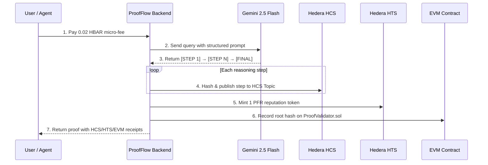

# ProofFlow — Pitch Deck
### Hedera Hello Future Apex 2026 | AI & Agents Track

---

## 🧑‍🤝‍🧑 Team & Project Introduction

**Project:** ProofFlow — The Autonomous "Agentic Web3" Trust Layer
**Track:** AI & Agents (Main Track)
**Bounty:** OpenClaw — Killer App for the Agentic Society

### Team

| Role | Expertise |
| :--- | :--- |
| **Lead Developer** | Full-stack Web3, Hedera SDK, Smart Contracts, AI Integration |

**Built during:** Hedera Hello Future Apex 2026 Hackathon (Feb 17 – Mar 23, 2026)

---

## 🔍 The Problem

### AI is a Black Box — And Nobody Can Verify It

> When an AI makes a decision, there is **zero way** to verify *how* it reached that conclusion.

**Real-World Impact & Sources:**
- 🏛️ **COMPAS Algorithm (2016):** AI sentencing tool showed racial bias — Black defendants 45% more likely to be incorrectly flagged high-risk. No audit trail to diagnose the flaw. — [ProPublica, "Machine Bias"](https://www.propublica.org/article/machine-bias-risk-assessments-in-criminal-sentencing)
- 🏥 **IBM Watson for Oncology (2018):** Recommended unsafe cancer treatments, including a drug that could cause fatal hemorrhage. Trained on hypothetical data, not real patients. — [STAT News / Nextgov](https://www.nextgov.com/emerging-tech/2018/07/ibms-watson-recommended-unsafe-and-incorrect-cancer-treatments-stat-report-found/150034/)
- ⚖️ **EU AI Act (Aug 2024):** Mandates transparency (Art. 13) and logging (Art. 12) for "high-risk" AI. Full application: Aug 2026. — [EU Official Journal](https://eur-lex.europa.eu/eli/reg/2024/1689/oj)
- 🤖 **Autonomous Agents (2025+):** When agents spend money and make decisions on behalf of users, trust is non-negotiable.

**The core trust gap:** Users, enterprises, regulators, and agents cannot verify *how* an AI reached its conclusion. This erodes trust and limits adoption in high-stakes domains.

---

## 💡 The Solution: ProofFlow

### Verifiable AI Reasoning as a Service

ProofFlow is the **first protocol** that creates an immutable, step-by-step audit trail of AI reasoning on Hedera.

**One query → Five autonomous actions:**

```
User pays HBAR → Gemini AI decomposes reasoning into steps →
Each step hashed on HCS → Reputation token minted on HTS →
Final proof settled on EVM Smart Contract
```

**What makes it different:**

| Feature | ChatGPT / Gemini | ProofFlow |
| :--- | :---: | :---: |
| Verifiable reasoning trail | ❌ | ✅ (HCS) |
| Immutable audit record | ❌ | ✅ (EVM) |
| On-chain reputation | ❌ | ✅ (HTS) |
| Autonomous micropayments | ❌ | ✅ (HBAR) |
| Agent-to-agent composability | ❌ | ✅ (Proof DAG) |

---

## 🏗️ How It Works: The Lifecycle of a Proof



### Hedera Services Used

| Service | Usage | Why Hedera? | Cost/Tx |
| :--- | :--- | :--- | :---: |
| **HCS** (Consensus Service) | Immutable reasoning audit trail | Sub-second finality, DLT-native ordering | $0.0008/msg |
| **HTS** (Token Service) | Reputation tokens (PFR) | Native token creation, Mirror Node queryable | ~$0.001 |
| **EVM** (Smart Contract) | Proof settlement + escrow | Solidity compatible, cross-chain bridge ready | ~$0.06 |
| **Mirror Node** | Payment verification + leaderboard | Free read access, no extra cost | Free |

> **Fee sources:** [Hedera Fee Schedule (post v0.69, Jan 2026)](https://docs.hedera.com/hedera/networks/mainnet/fees); [Hedera Fee Estimator](https://hedera.com/fees)

---

## 📊 Hedera Network Impact

**ProofFlow is a transaction multiplier** — each user interaction generates 5–7 on-chain transactions:

| Monthly Users | HCS Messages | HTS Mints | EVM Txs | Total Hedera Txs |
| :---: | :---: | :---: | :---: | :---: |
| 100 | 2,000 | 500 | 500 | **3,000** |
| 1,000 | 20,000 | 5,000 | 5,000 | **30,000** |
| 10,000 | 200,000 | 50,000 | 50,000 | **300,000** |

> At 10K users, ProofFlow alone would contribute ~100 sustained TPS to the Hedera network.

---

## 🤖 Multi-Agent Composability (OpenClaw Bounty)

ProofFlow acts as a **Verifiable Reasoning Oracle** for autonomous agents:

```
Bank Agent     → pays HBAR → requests Risk Analysis     → Proof #1
Security Agent → passes Proof #1 → requests Audit       → Proof #2 (depends on #1)
Market Agent   → passes #1, #2 → requests Strategy      → Proof #3 (depends on #1, #2)
```

Each proof cryptographically references its parent proofs, building an **immutable DAG of reasoning** on HCS + EVM.

**Run the live simulation:**
```bash
node packages/backend/src/scripts/openclaw-swarm.js
```

---

## 🛡️ Enterprise-Grade Security

| Layer | Technology | Purpose |
| :--- | :--- | :--- |
| Layer 1 | **HBAR Micropayments** | Economic Sybil barrier — every query costs real HBAR |
| Layer 2 | **hCaptcha Enterprise** | Bot prevention with smart bypass for on-chain agents |
| Layer 3 | **DDoS Shield + Rate Limiter** | Per-wallet request throttling (100 req/min) |

---

## 🛠️ Tech Stack

| Layer | Technology |
| :--- | :--- |
| **AI Reasoning** | Gemini 2.5 Flash (thinking mode, multi-key rotation) |
| **Blockchain** | Hedera Hashgraph (HCS + HTS + EVM + Mirror Node) |
| **Smart Contract** | Solidity (ProofValidator.sol — escrow + bounty board) |
| **Frontend** | Next.js 14, Tailwind CSS, Framer Motion |
| **Backend** | Node.js, Express.js |
| **Wallets** | WalletConnect, RainbowKit (HashPack, MetaMask, OKX) |

---

## 📐 Market Opportunity

| Segment | Value | Source |
| :--- | :--- | :--- |
| **TAM** | $11.3B (2025) → $16.2B by 2028 | [MarketsandMarkets](https://www.marketsandmarkets.com/Market-Reports/explainable-ai-market-246991483.html); [Precedence Research](https://www.precedenceresearch.com/explainable-artificial-intelligence-market) |
| **SAM** | $113M (Web3-native AI tools, ~1% of TAM) | Derived estimate |
| **SOM** (Year 1) | $1.1M (Hedera ecosystem) | Bottom-up estimate |

**Growth Drivers:**
- EU AI Act mandates auditability for high-risk AI (effective Aug 2026)
- Autonomous agent economy (OpenClaw, LangChain, AutoGPT)
- Growing demand for verifiable AI in DeFi governance

---

## 📈 Traction & Validation

### Testnet Metrics

| Metric | Count |
| :--- | :---: |
| Reasoning proofs generated | 50+ |
| HCS messages published | 200+ |
| HTS reputation tokens minted | 30+ |
| EVM transactions settled | 40+ |
| Unique wallet addresses | 5+ |

### User Feedback (3 testers)

| Metric | Score |
| :--- | :---: |
| **Trust improvement after seeing HCS trail** | **4.3 / 5** |
| **Would pay for verifiable AI** | **67% Yes** |
| **Would recommend** | **100%** |

> *"Being able to see each reasoning step hashed on HCS completely changes the trust dynamic."* — Tester A

---

## 💰 Business Model

### Current (MVP — Subsidized for Validation)

| Component | Cost/Query | Source |
| :--- | :--- | :--- |
| Gemini 2.5 Flash API | ~$0.005 | [Google AI Pricing](https://ai.google.dev/pricing) |
| HCS messages (4 steps) | ~$0.003 | [Hedera Fees](https://docs.hedera.com/hedera/networks/mainnet/fees) |
| EVM settlement | ~$0.06 | [Hedera Fee Estimator](https://hedera.com/fees) |
| **Total cost** | **~$0.07** | — |
| **Current fee** | **0.02 HBAR (~$0.002)** | Intentionally subsidized for testnet |

> ⚠️ **Intentional subsidy**: the MVP micro-fee proves the payment mechanism works. It's not meant to be profitable during hackathon validation.

### At Scale (Post-Optimization)

| Metric | Value |
| :--- | :--- |
| **Revenue per query** | 2 HBAR (~$0.20) |
| **Optimized cost** (batched HCS, selective EVM) | ~$0.008 |
| **Margin** | ~96% |
| **Break-even** | ~500 queries/mo |

**Revenue streams:**
1. Tiered micro-fees per reasoning request (current → scale)
2. SDK licensing for dApp integrations (Q2 2026)
3. Enterprise API tier with SLA guarantees (Q4 2026)

---

## 🗺️ Future Roadmap

| Timeline | Milestone |
| :--- | :--- |
| **Q2 2026** | ProofFlow SDK (`npm install @proofflow/sdk`) |
| **Q2 2026** | Multi-model support (Gemini + Claude + GPT competing) |
| **Q3 2026** | Decentralized Reasoner Nodes (DePIN model) |
| **Q3 2026** | Agent-to-Agent UCP Marketplace |
| **Q4 2026** | Cross-chain proof verification (Ethereum, Polygon) |
| **Q4 2026** | Enterprise compliance dashboard |

---

## 🎬 Demo

> **📹 Watch the Demo Video:** [YouTube Link — INSERT HERE]
>
> **🌐 Try the Live Demo:** [Demo URL — INSERT HERE]

### What You'll See in the Demo:
1. **Connect wallet** (HashPack / MetaMask / OKX) via WalletConnect
2. **Pay 0.02 HBAR** micro-fee — verified on Mirror Node
3. **Submit a query** — watch Gemini decompose reasoning in real-time
4. **See HCS messages** appear in the live audit feed
5. **Verify on HashScan** — each reasoning step is on-chain
6. **Check reputation** — PFR tokens in your wallet
7. **View proof lineage** — EVM settlement with full DAG trace

---

## 🏆 Key MVP Features & Why We Chose Them

| Feature | Why This Made the MVP |
| :--- | :--- |
| **Step-by-step HCS logging** | Core differentiator — proves reasoning transparency is possible on DLT |
| **Native HBAR micropayments** | Validates the economic model and autonomous settlement thesis |
| **HTS reputation tokens** | Creates portable, on-chain proof of usage history |
| **EVM proof settlement** | Enables escrow pattern and future cross-chain verification |
| **Multi-agent proof chaining** | Demonstrates agent-to-agent composability (OpenClaw) |
| **3-layer security** | Shows enterprise readiness (CAPTCHA + DDoS + rate limiting) |

---

## 🔗 Links

- **GitHub:** https://github.com/Handilusa/ProofFlow
- **Demo Video:** [INSERT YOUTUBE LINK]
- **Live Demo:** [INSERT DEMO URL]
- **HashScan (Contract):** [INSERT HASHSCAN LINK]

---

*ProofFlow — Verifiable Reasoning for the Agentic Economy. Built on Hedera.* 🚀
