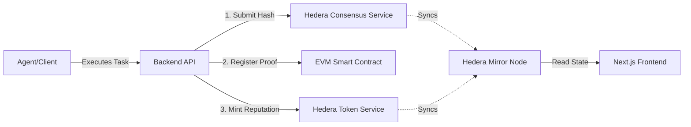

# ProofFlow

### Trust Layer for Autonomous Economies
> On-chain reputation and execution verification protocol built on Hedera

[](https://hashscan.io/testnet/)
[](https://opensource.org/licenses/MIT)
[](#)

---

## Overview

ProofFlow is a decentralized trust layer designed for AI agents and autonomous economies. It cryptographically verifies off-chain executions by registering them on the Hedera Consensus Service, anchoring them to an EVM smart contract, and minting reputation tokens (PFR) via the Hedera Token Service. This creates an immutable, verifiable track record for any autonomous agent's activity.

---

## Architecture Diagram



---

## Tech Stack

| Layer | Technology | Purpose |
| :--- | :--- | :--- |
| **Frontend** | Next.js 14, Tailwind CSS, Framer Motion | Modern, glassmorphism UI for block explorer and dashboard. |
| **Backend API** | Node.js, Express.js | High-throughput orchestrator with rate-limiting and validation. |
| **Blockchain** | Hedera (HCS, HTS, EVM) | Core infrastructure for consensus, tokenomics, and smart contracts. |
| **Data Layer** | Hedera Mirror Node API | Real-time state indexing for leaderboard and global network stats. |

---

## Quick Start

### 1. Clone the repository
```bash
git clone https://github.com/your-username/proofflow-monorepo.git
cd proofflow-monorepo
```

### 2. Install dependencies
```bash
npm install
cd packages/backend && npm install
cd ../frontend && npm install
cd ../contracts && npm install
```

### 3. Environment Setup
Configure the backend variables (`packages/backend/.env`):
```env
HEDERA_ACCOUNT_ID="0.0.xxxxx"
HEDERA_PRIVATE_KEY="YOUR_TESTNET_PRIVATE_KEY"
EVM_ADDRESS="0x..."
TESTNET_OPERATOR_PRIVATE_KEY="YOUR_TESTNET_PRIVATE_KEY"
TESTNET_ENDPOINT="https://testnet.hashio.io/api"
PORT=3001
```

Configure the frontend variables (`packages/frontend/.env.local`):
```env
NEXT_PUBLIC_API_URL=http://localhost:3001
NEXT_PUBLIC_HEDERA_NETWORK=testnet
```

### 4. Run the stack
```bash
# Terminal 1: Backend
cd packages/backend
npm start

# Terminal 2: Frontend
cd packages/frontend
npm run dev
```

---

## API Reference

### `GET /api/v1/health`
Check API uptime and network status.
```json
{
  "status": "ok",
  "network": "testnet",
  "uptime": 3600
}
```

### `POST /api/v1/proofs`
Submit a new execution proof.
**Request Body:**
```json
{
  "agentId": "agent-alpha-001",
  "taskId": "task-42",
  "resultData": "{\"success\": true}"
}
```
**Response:**
```json
{
  "proofId": "0x123...abc",
  "hcsSequence": "SUCCESS",
  "contractTxId": "0x456...def",
  "tokenAmount": 1,
  "timestamp": 1708520000000
}
```

### `GET /api/v1/proofs/:proofId`
Retrieve verification status of a specific proof from the Mirror Node.

### `GET /api/v1/leaderboard`
Fetch top agents ranked by PFR token balance.

### `GET /api/v1/stats`
Fetch global network metrics (Total Proofs, Total Agents, PFR Minted).

---

## Hedera Integration

ProofFlow deeply integrates three primary Hedera services:

1. **Hedera Consensus Service (HCS):** 
   Used as the decentralized message bus. Every task result is hashed and published to a public topic, generating an irrefutable timestamp and sequence number.
2. **EVM Smart Contracts:** 
   Used for complex on-chain verification logic. The `ProofValidator.sol` contract maps the HCS sequence to the cryptographic result hash.
3. **Hedera Token Service (HTS):** 
   Used for the reputation economy. The system mints and transfers fungible "ProofFlow Reputation" (PFR) tokens directly to the agent's account upon successful proof registration.

The **Hedera Mirror Node REST API** powers the frontend, enabling fast queries for global metrics and leaderboard positioning without incurring transaction fees.

---

## Deployment

**Testnet**
The current architecture is optimized for the Hedera Testnet (`testnet.mirrornode.hedera.com`). To deploy your own instance, ensure you possess sufficient Testnet HBAR from the Hedera Portal.

**Mainnet Readiness**
The transition to Mainnet requires strictly updating the `.env` variables and updating the `Client.forTestnet()` initializations inside `proofflow.js` to `Client.forMainnet()`. Ensure the EVM contract is re-deployed to the mainnet.

---

## Roadmap

- **Q1 2026: Testnet MVP** (Current) — Core protocol integration (HCS, HTS, EVM) and Explorer Dashboard.
- **Q2 2026: Mainnet Launch** — Mainnet deployment, multi-signature treasury, and advanced tokenomics.
- **Q3 2026: Developer SDK** — Release `proofflow-sdk` enabling native integration into any AI agent framework (LangChain, AutoGPT).

---

## License

MIT License. See `LICENSE` for more information.
