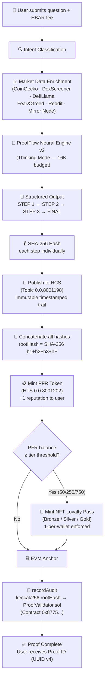
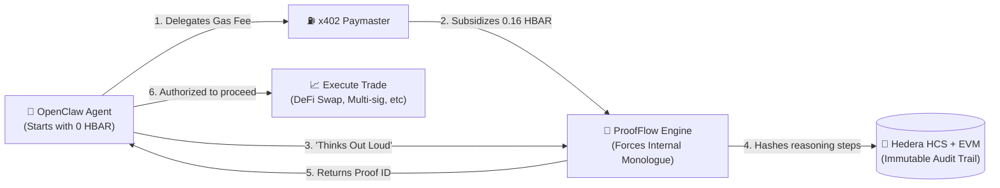

# ProofFlow (v1.0.4)

### The Autonomous "Agentic Web3" Trust Layer
> Verifiable reasoning, immutable audit trails, and autonomous settlement on Hedera.

[](https://hashscan.io/testnet/)
[](https://opensource.org/licenses/MIT)
[](https://hackathon.stackup.dev/web/events/hedera-hello-future-apex-hackathon-2026)
[](https://proofflow-layer.vercel.app/)

---

## 📝 Project Description (100 words)

ProofFlow is an autonomous agent protocol that solves the AI "Black Box" problem by creating verifiable, immutable audit trails for every AI reasoning step. When a user pays a native HBAR micro-fee, the **ProofFlow Neural Engine v2** — a crypto-specialized reasoning agent trained with Gemini 2.5 Flash — decomposes their query into logical steps, hashes each step onto Hedera Consensus Service (HCS), mints a reputation credential via Hedera Token Service (HTS), and settles the final proof on an EVM smart contract — all autonomously, without human intervention. ProofFlow enables trustless agent-to-agent composability through cryptographically chained proof DAGs, positioning Hedera as the trust backbone for the Agentic Economy.

---

## 🚀 Overview: The AI & Agents Challenge

**ProofFlow** is an autonomous agent protocol designed for the **Hello Future Apex 2026 Hackathon**. It solves the "Black Box" problem of AI by fusing decentralized infrastructure with autonomous reasoning.

When a user interacts with ProofFlow, they aren't just talking to a chatbot. They are triggering an **Agentic Workflow** where the **ProofFlow Neural Engine v2** — a crypto-specialized autonomous agent — manages the entire lifecycle: from picking up the request after a native HBAR micropayment to logging every reasoning step on **HCS**, minting reputation credentials on **HTS**, and settling the final proof on an **EVM Smart Contract**.

---

## 🌐 Why This Must Be Web3 (Not Web2) — Trustless Verification

A centralized server with a database could store AI reasoning logs — but it cannot provide **trustless verification**:

| Requirement | Web2 (Centralized DB) | ProofFlow (Hedera) |
| :--- | :---: | :---: |
| **Tamper-proof audit trail** | ❌ Admin can alter records | ✅ HCS is immutable, timestamped by network consensus |
| **Third-party verifiability** | ❌ Requires trusting the operator | ✅ Anyone can verify via Mirror Node / HashScan |
| **Censorship resistance** | ❌ Single point of failure | ✅ Decentralized Hashgraph consensus |
| **Multi-stakeholder trust** | ❌ Each party must trust the server | ✅ Neutral shared ledger, no trusted intermediary |
| **Autonomous agent settlement** | ❌ Needs custodial banking rails | ✅ Native HBAR micropayments, no intermediary |
| **Cross-platform proof portability** | ❌ Locked in vendor silo | ✅ Proofs are on-chain public goods, composable across dApps |

> **Bottom Line:** ProofFlow's value is *not* the AI reasoning itself — it's the **cryptographic guarantee** that the reasoning hasn't been altered, censored, or fabricated. Only a decentralized ledger provides this. Every step is **cryptographic evidence anchored to the public book of Hedera**.

---

## 🏗️ Architectural Flow: "The Lifecycle of a Proof"

ProofFlow demonstrates a true **multi-service integration** on Hedera:

1. **Autonomous Trigger**: User deposits a native HBAR micro-fee into the ProofValidator smart contract.
2. **Market Data Enrichment**: The agent classifies the query by intent and fetches real-time data from up to 7 APIs simultaneously — CoinGecko, DexScreener, DefiLlama, Fear & Greed Index, SaucerSwap (via DexScreener), Hedera Mirror Node (mainnet), and Reddit — injecting quantitative context into the AI prompt.
3. **Neural Engine v2 Inference (Thinking Mode)**: The **ProofFlow Neural Engine v2** — a crypto-specialized reasoning agent trained with Gemini 2.5 Flash — uses a **16,384 thinking token budget** to decompose the problem into structured reasoning steps (`<STEP 1>`, `<STEP 2>`, `<STEP 3>`, `<FINAL>`). This is not generic text generation — the engine is instructed to reason *mathematically*, citing hard data, calculating breakeven thresholds, and using historical maximums as stress-test scenarios.
4. **HCS Audit Logging**: Every internal "thought" and step is SHA-256 hashed and published to the **Hedera Consensus Service (HCS)** topic in real-time. This creates an immutable, timestamped trail of *how* the AI reached its conclusion.
5. **HTS Reputation Minting**: Upon successful completion, the agent mints **PFR** (ProofFlow Reputation) fungible tokens to the user's wallet, tracking their lifetime audit count on-chain.
6. **NFT Loyalty Pass Milestone**: If the user's PFR balance crosses a tier threshold, a **non-fungible loyalty NFT** is automatically minted (1-per-wallet enforcement via SDK `AccountBalanceQuery`).
7. **EVM Settlement**: The Agent signs a transaction to the `ProofValidator.sol` smart contract to record the `keccak256` hash of the final result on-chain, creating permanent cryptographic evidence.

### End-to-End Pipeline Diagram


```mermaid
flowchart TD
    A["🧑 User submits question + HBAR fee"] --> B["🔍 Intent Classification"]
    B --> C["📊 Market Data Enrichment<br/>(CoinGecko · DexScreener · DefiLlama<br/>Fear&amp;Greed · Reddit · Mirror Node)"]
    C --> D["🧠 ProofFlow Neural Engine v2<br/>(Thinking Mode — 16K budget)"]
    D --> E["📝 Structured Output<br/>STEP 1 → STEP 2 → STEP 3 → FINAL"]
    E --> F["🔒 SHA-256 Hash<br/>each step individually"]
    F --> G["📡 Publish to HCS<br/>(Topic 0.0.8001198)<br/>Immutable timestamped trail"]
    G --> H["🔗 Concatenate all hashes<br/>rootHash = SHA-256 h1+h2+h3+hF"]
    H --> I["🪙 Mint PFR Token<br/>(HTS 0.0.8001202)<br/>+1 reputation to user"]
    I --> J{"PFR balance<br/>≥ tier threshold?"}
    J -- "Yes (50/250/750)" --> K["🏅 Mint NFT Loyalty Pass<br/>(Bronze / Silver / Gold)<br/>1-per-wallet enforced"]
    J -- "No" --> L["⛓️ EVM Anchor"]
    K --> L
    L --> M["📜 recordAudit<br/>keccak256 rootHash → ProofValidator.sol<br/>(Contract 0x8775...)"]
    M --> N["✅ Proof Complete<br/>User receives Proof ID (UUID v4)"]
```

> **Key insight:** The raw question and AI response **never** touch the blockchain. Only SHA-256 hashes of each step and the final `keccak256(rootHash)` are stored on-chain. The Proof ID allows anyone to independently verify the full chain via the HCS Mirror Node and the EVM contract.

---

## 🔐 Hash-Based On-Chain Privacy: What Actually Goes on the Blockchain

A common misconception is that ProofFlow stores the raw questions and AI answers on the blockchain. **It does not.** What is stored on-chain are **cryptographic hashes** — compact, fixed-length fingerprints that prove the content existed at a specific point in time without revealing the content itself.

**What goes on HCS (Hedera Consensus Service):**

Each reasoning step is individually hashed using SHA-256 before being published:

```
Step content: "HBAR's current price is $0.18 with a 24h volume of..."
     ↓ SHA-256
On-chain hash: a3f8c9d2e1b4a7f6c5d3e2f1a0b9c8d7e6f5a4b3c2d1e0f9a8b7c6d5e4f3a2b1
```

After all steps are published, their hashes are **concatenated and hashed again** to produce a single `rootHash` — a Merkle-like fingerprint of the entire reasoning chain:

```
rootHash = SHA-256(hash_step1 + hash_step2 + hash_step3 + hash_final)
```

**What goes on the EVM (ProofValidator.sol):**

The `rootHash` is then converted to `keccak256` and submitted to the smart contract via `submitResult()` or `recordAudit()`. This creates a permanent, on-chain anchor that anyone can verify.

**Verification flow:**

The user receives a **Proof ID** (UUID v4) for each audit. Using this ID, anyone can:

1. **Query the HCS topic** via Mirror Node to retrieve all `REASONING_STEP` messages for that Proof ID.
2. **Recompute the hashes** from the step content and verify they match what's on-chain.
3. **Check the EVM contract** to confirm the `rootHash` was settled and the audit was completed.

> **Why this matters:** The blockchain acts as a **tamper-evident seal**, not a data store. If anyone modifies even a single character of any reasoning step, the hash chain breaks — providing irrefutable proof of tampering.

---

## 🌍 Multi-Language DApp Interface

ProofFlow is designed for global accessibility from day one. The decentralized application (dApp) features a built-in language selector in the Options menu, allowing users to seamlessly switch the entire frontend interface between **English** and **Spanish**.

This localization extends to the autonomous agent as well. The ProofFlow Neural Engine automatically detects the user's language and enforces a strict localization rule:
- If the user interacts in **English** → the agent responds and reasons entirely in English.
- If the user interacts in **Spanish** → the agent responds and reasons entirely in Spanish.

This ensures a fully native, cohesive experience for users across Latin America, Spain, and the English-speaking world — both in the UI they navigate and the on-chain audit trails they generate.

---

## 🔗 On-Chain Contracts & Tokens (Hedera Testnet)

All infrastructure is **deployed and live on Hedera Testnet**. Every ID below can be independently verified on [HashScan](https://hashscan.io/testnet/).

| Asset | Type | Hedera ID / Address | HashScan Link |
| :--- | :--- | :--- | :--- |
| **ProofValidator** | EVM Smart Contract | `0x8775602A748990a4204C4b21BF44d31549802A7f` | [View on HashScan](https://hashscan.io/testnet/contract/0x8775602A748990a4204C4b21BF44d31549802A7f) |
| **Agent Wallet** | EVM Operator | `0xCaC05e7762a0B4e200f4fa217284D3Ac4a10ADe6` | [View on HashScan](https://hashscan.io/testnet/account/0xCaC05e7762a0B4e200f4fa217284D3Ac4a10ADe6) |
| **PFR Token** | HTS Fungible (Reputation) | `0.0.8001202` | [View on HashScan](https://hashscan.io/testnet/token/0.0.8001202) |
| **HCS Audit Topic** | HCS Topic | `0.0.8001198` | [View on HashScan](https://hashscan.io/testnet/topic/0.0.8001198) |
| **Genesis NFT** | HTS Non-Fungible | `0.0.8170105` | [View on HashScan](https://hashscan.io/testnet/token/0.0.8170105) |
| **Bronze Audit Pass** | HTS Non-Fungible | `0.0.8193220` | [View on HashScan](https://hashscan.io/testnet/token/0.0.8193220) |
| **Silver Audit Pass** | HTS Non-Fungible | *(Minted on first Silver milestone)* | — |
| **Gold Audit Pass** | HTS Non-Fungible | *(Minted on first Gold milestone)* | — |

---

## 🏅 Loyalty NFT Tier System & Fee Discounts

ProofFlow rewards loyal users with a **tiered NFT loyalty program** that unlocks progressive fee discounts on the HBAR network fee. As users complete more audits and accumulate PFR tokens, they unlock increasingly valuable tiers:

| Tier | PFR Required | NFT Pass | Fee Discount | Effective Network Fee |
| :---: | :---: | :--- | :---: | :---: |
| **Free** | 0 | — | 0% | ~0.16 HBAR |
| **🥉 Bronze** | 50 PFR | ProofFlow Audit Pass - BRONZE | 10% | ~0.14 HBAR |
| **🥈 Silver** | 250 PFR | ProofFlow Audit Pass - SILVER | 20% | ~0.13 HBAR |
| **🥇 Gold** | 750 PFR | ProofFlow Audit Pass - GOLD | 30% | ~0.11 HBAR |
| **🌟 Genesis** | Invite Only | Genesis NFT (Limited Edition) | Special | — |

**Key Design Decisions:**

- **1-per-wallet enforcement**: Each NFT tier is limited to 1 NFT per wallet, enforced via SDK `AccountBalanceQuery` on Hedera consensus nodes (not Mirror Node), ensuring trustless verification.
- **Automatic minting**: When a user's PFR balance crosses a threshold after an audit, the NFT is minted and transferred automatically — no manual claim needed.
- **On-chain elegance**: Tier ownership is checked via SDK consensus queries, not off-chain databases.

### 🔀 EVM ↔ Hedera Address Resolution

ProofFlow supports **both EVM wallets (MetaMask, OKX)** and **native Hedera wallets (HashPack)** seamlessly. Since users can connect with either format, the backend includes a universal address resolver that bridges both ecosystems:

```
User connects with 0x7a3F...  (EVM)     →  resolveAccountId()  →  0.0.8026799 (Hedera native)
User connects with 0.0.8026799 (native)  →  resolveAccountId()  →  0.0.8026799 (Hedera native)
```

**How it works:**

1. **Detection**: When any address reaches the backend, `resolveAccountId()` checks if it starts with `0x` (EVM) or `0.0.` (native Hedera).
2. **EVM Resolution**: For EVM addresses, it uses `AccountId.fromEvmAddress(0, 0, evmAddress)` — a deterministic local conversion from the Hedera SDK that maps the 20-byte EVM alias to the corresponding Hedera `AccountId`.
3. **Consensus Validation**: The resolved `AccountId` is then used in an `AccountBalanceQuery` against a Hedera consensus node to verify the account exists and check its token balances.
4. **Graceful Handling**: If the account doesn't exist on Hedera yet (e.g., a brand-new MetaMask wallet that hasn't interacted with the network), the system returns `owned: false` instead of crashing — preventing false positives.

**Why this matters for NFT enforcement:**

Without this resolution layer, a user could theoretically bypass the 1-per-wallet limit by connecting once via MetaMask (`0x7a3F...`) and again via HashPack (`0.0.8026799`) — even though both point to the same on-chain account. ProofFlow's resolver ensures that **regardless of how the user connects, the same underlying Hedera account is checked**, making the 1-per-wallet rule truly trustless.

---

## 🧠 ProofFlow Neural Engine v2: Mathematical Reasoning Agent

The **ProofFlow Neural Engine v2** is a crypto-specialized autonomous reasoning agent trained with Google's Gemini 2.5 Flash. Unlike generic AI chatbots, it is configured in **structured thinking mode** with specific parameters designed for quantitative, auditable analysis:

```json
{
  "generationConfig": {
    "temperature": 0.7,
    "maxOutputTokens": 32768,
    "thinkingConfig": {
      "thinkingBudget": 16384
    }
  },
  "tools": [{ "googleSearch": {} }]
}
```

**What this means:**

1. **16K Thinking Budget**: The engine allocates up to 16,384 internal "thinking tokens" before generating its visible output, enabling deep multi-step mathematical reasoning.
2. **Structured Step Output**: The system instruction forces the engine to produce a minimum of 3 `<STEP N>` stages and 1 `<FINAL>` conclusion. Each step is independently hashed (SHA-256) and published to HCS.
3. **Quantitative Mandate**: The agent is explicitly instructed to *never* say "Insufficient Data." Instead, it must:
   - Calculate **breakeven thresholds** using available data.
   - Use **historical maximums** as stress-test scenarios when variables are unknown.
   - Always provide a **definitive quantitative conclusion**, labeling assumptions clearly.
4. **Live Search Grounding**: The engine has access to `googleSearch` tools for real-time web data during reasoning, complementing the Market Data Enrichment Engine.
5. **Multi-Key Rotation**: The backend supports up to 10 API keys with round-robin rotation and exponential backoff to prevent rate-limit downtime during high-traffic periods.

---

## 📊 Market Data Enrichment Engine (7 Live APIs)

Before the AI reasons, ProofFlow's **Intelligent API Router** classifies the user's question by intent and fetches *only* the relevant data from free, public APIs:

| API Source | Data Provided | When Triggered |
| :--- | :--- | :--- |
| **CoinGecko** | Price, market cap, volume, ATH, supply, 1h/24h/7d changes | Any crypto price/comparison question |
| **DexScreener** | DEX pair prices, liquidity, on-chain volume | Token-specific questions (non-HBAR) |
| **SaucerSwap** (via DexScreener) | HBAR LP pools, TVL, calculated Base APR | HBAR DeFi / yield questions |
| **DefiLlama** | Protocol TVL, chain TVL, TVL trends | DeFi protocol / ecosystem questions |
| **Fear & Greed Index** | 7-day sentiment trend (0–100 scale) | Sentiment / market mood questions |
| **Hedera Mirror Node** | Total supply, staking APR, stake totals, daily rewards | HBAR network / staking questions |
| **Reddit** | Top posts from r/cryptocurrency, r/CryptoMarkets, etc. | News / social / opinion questions |

**SaucerSwap APR Calculation** (genuine protocol math):  
```
Base APR = (24h_Volume × 0.25% LP Fee × 365) / TVL × 100
```
This is calculated using real DexScreener data, not inflated marketing numbers.

---

## 🛡️ Enterprise-Grade Protection

ProofFlow incorporates a robust 3-layer security system to protect the autonomous infrastructure:

1. **Hedera Micropayments**: Every request requires an on-chain HBAR fee settlement — no free rides.
2. **hCaptcha Enterprise**: Prevents bot-net spam while dynamically ignoring valid on-chain agent requests.
3. **Decentralized Rate Limiting**: Request throttling tied to the connected Hedera Wallet Address.

---

## 🤖 OpenClaw Bounty: Killer App for the Agentic Society

ProofFlow is **agent-first public infrastructure** — the primary users are autonomous agents, not humans. The human-facing dashboard exists to *observe* agent activity.

We designed ProofFlow specifically to solve the two biggest blockers to enterprise AI agent adoption (like OpenClaw):

### 1. Solving the Black Box: "OpenClaw Auditable"
The biggest fear with frameworks like OpenClaw or AutoGPT is that they make autonomous financial decisions without anyone knowing *why*. ProofFlow fixes this by forcing agents to **"Think Out Loud"**. 

Before an OpenClaw agent executes a trade or signs a multi-sig, it must route its internal monologue (the Neural Engine's `thinkingBudget`) to ProofFlow. ProofFlow hashes each step of the agent's reasoning to Hedera HCS in real-time. This creates an immutable, tamper-evident audit trail of the agent's decision-making process *before* the action is taken.

### 2. Solving Fee Friction: x402 Agentic Wallets
Agents can't easily hold private keys to pay gas fees. ProofFlow's architecture is designed to support **Agentic Wallets (x402 / EIP-4337)**. In our model, the agent's wallet starts with 0 HBAR. When it needs to log an audit to HCS, an on-chain **Paymaster** dynamically subsidizes the ProofFlow micro-fee. The agent operates frictionlessly while still enforcing economic Sybil resistance.

### 🐝 OpenClaw x402 Swarm Simulation

The project includes a **fully functional multi-agent simulation** (`openclaw-swarm.js`) that demonstrates this exact architecture live on Hedera Testnet:

```bash
# Ensure ProofFlow backend is running on localhost:3001
node packages/backend/src/scripts/openclaw-swarm.js
```

**The flow:**
1. Initialized OpenClaw Agents start with an empty wallet (0 HBAR).
2. A simulated **x402 Paymaster** subsidizes their HBAR fee.
3. The agents **Think Out Loud**, generating a cryptographic internal monologue.
4. The monologue is anchored to HCS + EVM.
5. Only after verification is the agent authorized to execute its trade.

### Visual Architecture: OpenClaw Auditable x402 Flow


```mermaid
flowchart LR
    %% Entities
    Agent["🤖 OpenClaw Agent<br>(Starts with 0 HBAR)"]
    Paymaster["⛽ x402 Paymaster"]
    Engine["🧠 ProofFlow Engine<br>(Forces Internal Monologue)"]
    Ledger[("📡 Hedera HCS + EVM<br>(Immutable Audit Trail)")]
    Trade["📈 Execute Trade<br>(DeFi Swap, Multi-sig, etc)"]

    %% Flow
    Agent -- "1. Delegates Gas Fee" --> Paymaster
    Paymaster -- "2. Subsidizes 0.16 HBAR" --> Engine
    Agent -- "3. 'Thinks Out Loud'" --> Engine
    Engine -- "4. Hashes reasoning steps" --> Ledger
    Engine -- "5. Returns Proof ID" --> Agent
    Agent -- "6. Authorized to proceed" --> Trade
```

### 🌟 Why This is Revolutionary for the Agentic Society

The industry is racing to build autonomous agents, but standard agents are fundamentally broken for enterprise and decentralized finance. ProofFlow fixes them:

1. **Eradicates the "AI Black Box"**: Today, AutoGPT and OpenClaw agents execute trades. If they lose money, you don't know why. By forcing them to route their "Internal Monologue" to Hedera HCS *before* execution, you get a **tamper-proof, cryptographically secure post-mortem** of their exact logic.
2. **Zero-Friction Onboarding (x402)**: You no longer need to manually fund 10,000 different agent wallets with gas. The x402 Paymaster model means agents can spin up, request gas dynamically, pay for their own audits, and execute without touching private keys.
3. **Agent-to-Agent Trust**: Because agents earn PFR (Reputation Tokens) and their logic is on-chain, Agent A can mathematically verify the reasoning of Agent B before interacting with it. ProofFlow acts as the **Trust Layer** for the Agentic Web3 Economy.

### OpenClaw Bounty Compliance

| Requirement | Status | Implementation |
| :--- | :---: | :--- |
| App is agent-first | ✅ | OpenClaw agents are the core users, routing logs via REST API. |
| Autonomous behavior | ✅ | Agents autonomously pay via Paymaster and log thoughts without humans. |
| Value in multi-agent env | ✅ | Creates a shared, verifiable knowledge graph of agent decisions. |
| Hedera tech used | ✅ | All three: HCS (audit), HTS (reputation), EVM (settlement/escrow). |
| Public repo | ✅ | [github.com/Handilusa/ProofFlow](https://github.com/Handilusa/ProofFlow) |
| Live demo URL | ✅ | [proofflow-layer.vercel.app](https://proofflow-layer.vercel.app/) |
| <3 min demo video | ✅ | [INSERT YOUTUBE LINK] |
| README with setup | ✅ | You're reading it. |

---

## 🛠️ Tech Stack

| Layer | Technology | Purpose |
| :--- | :--- | :--- |
| **AI Reasoning** | ProofFlow Neural Engine v2 (trained with Gemini 2.5 Flash) | 16K thinking budget, structured multi-step decomposition with live search grounding. |
| **Blockchain** | Hedera (HCS, HTS, EVM) | The backbone for consensus-level audit trails, reputation tokens, and on-chain settlement. |
| **Smart Contract** | Solidity (ProofValidator.sol) | Autonomous escrow: users deposit HBAR → agent delivers → contract settles bounty. |
| **Market Data** | CoinGecko, DexScreener, DefiLlama, Fear & Greed, Reddit | 7 free APIs for real-time market intelligence injected into AI reasoning. |
| **Frontend** | Next.js 14, Tailwind, Framer Motion | Premium dashboard with interactive terminal and live audit feed. |
| **Backend** | Node.js, Express | Autonomous orchestrator, market data router, and Hedera service manager. |
| **Connectivity** | WalletConnect / RainbowKit | Multi-ecosystem wallet support (HashPack, MetaMask, OKX). |
| **Security** | hCaptcha + DDoS Shield + Rate Limiter | 3-layer bot protection tied to wallet addresses. |

---

## 🧠 Key Design Decisions (ADR)

| Decision | Choice | Rationale |
| :--- | :--- | :--- |
| **Why HCS for audit trail?** | Hedera Consensus Service | Sub-second finality (~3-5s), ordered timestamps, and $0.0001/msg makes it viable for per-step logging. No other L1 can do this economically. |
| **Why this foundation model?** | Gemini 2.5 Flash (thinking mode) | Native "thinking budget" parameter allows explicit multi-step reasoning that maps cleanly to our `<STEP N>` → `<FINAL>` structured output format. The Neural Engine v2 adds crypto-specific system instructions and API enrichment on top. |
| **Why EVM for settlement?** | Solidity Smart Contract (ProofValidator.sol) | Enables on-chain escrow (users deposit HBAR → agent delivers → contract settles), which is impossible with HCS alone. Also enables future cross-chain bridge verification. |
| **Why fungible tokens for reputation?** | HTS Fungible (PFR) | Fungible tokens allow additive reputation scores queryable via Mirror Node, enabling leaderboards and tiered access without complex NFT metadata. |
| **Why NFTs for loyalty passes?** | HTS Non-Fungible (per tier) | NFTs serve as composable, on-chain credentials: Bronze/Silver/Gold badges grant fee discounts and signal user commitment across dApps. |
| **Why SDK for ownership checks?** | `AccountBalanceQuery` (consensus node) | SDK queries hit consensus nodes directly, guaranteeing real-time accuracy. Mirror Node has propagation delays that could allow exploits. |
| **Why micropayments?** | 0.16 HBAR per query (decreasing with tier) | Creates an economic Sybil barrier, generates sustainable revenue, and proves the "autonomous settlement" thesis. Hedera's $0.0001 tx fee makes sub-cent payments viable. |
| **Why multi-key rotation?** | Round-robin API keys (up to 10) | Prevents rate limiting from killing the service during high-traffic periods. Graceful degradation with exponential backoff. |

---

## 📡 API Reference

The ProofFlow backend exposes a robust API for agent coordination:

### `GET /api/v1/config`
Fetch network configuration, contract addresses, and current operator fee (HBAR).

### `POST /api/v1/reason`
**Body**: `{ question: string, requesterAddress?: string, paymentTxHash?: string, parentProofIds?: string[] }`
Triggers the full autonomous pipeline. Accepts optional `parentProofIds` to inject cryptographically verified HCS context from other agents. Returns the reasoning result.

### `GET /api/v1/proof/:id`
Retrieves the full HCS reasoning chain and metadata for a specific proof.

### `GET /api/v1/verify/:proofId`
Returns deep lineage verification data, tracing the full DAG of proof dependencies down to their root EVM transaction hashes.

### `GET /api/v1/leaderboard`
Ranks users based on their HTS Reputation Token (PFR) balances indexed via the Mirror Node. Includes Genesis NFT holder badge.

---

## 📦 Quick Start

```bash
# Clone and install
git clone https://github.com/Handilusa/ProofFlow.git
cd ProofFlow
npm install

# Configure Backend (.env in packages/backend/)
HEDERA_ACCOUNT_ID_TESTNET="0.0.xxxx"
HEDERA_PRIVATE_KEY_TESTNET="xxxx"
TESTNET_OPERATOR_PRIVATE_KEY="xxxx"  # EVM-compatible key for contract interaction
GEMINI_API_KEY="xxxx"
# Optional: GEMINI_API_KEY_2, GEMINI_API_KEY_3, ... up to _10

# Run stack
cd packages/backend && npm start       # Backend on :3001
cd packages/frontend && npm run dev    # Frontend on :3000
```

> **Windows Users**: Set `NEXT_IGNORE_INCORRECT_LOCKFILE=true` before running `npm run dev` to bypass a known Next.js 14 monorepo lockfile bug.

---

## ⚖️ License

MIT License — Developed for the **Hedera Apex 2026 Hackathon** 🚀
